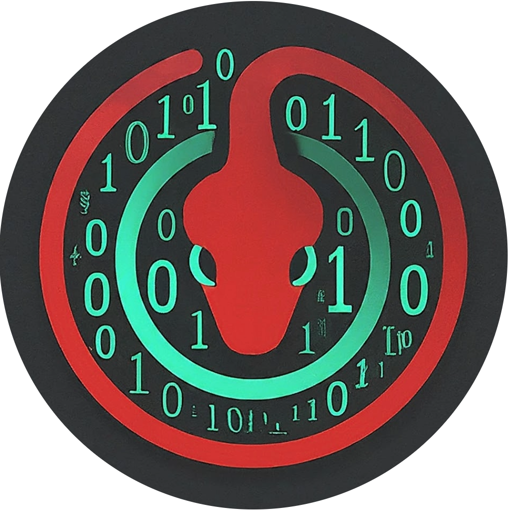

# OSTE-MalStatWare
<div style="text-align: center;">

</div>

# MalStatWare
MalStatWare automates malware analysis with Python. Extract key details like file size, type, hash, path, and digital signature. It analyzes headers, APIs, and strings, giving quick insights for threat detection. Soon adding features like searching for the existence of any IOC in your system or the path you chose to scan.

## Contents

- [Features](#features)
- [Installation](#installation)
- [Usage](#usage)
- [Contribution](#contribution)
- [Reaching Out](#reaching-out)

## Features

- Extracting static information such as:
  - Real extension
  - Name
  - Size
  - SHA-1
  - SHA-256
  - MD5
- Searching for the Existing of the file in chosen directory or all the system.
## Installation

### Requirements

- Python 3.x

### Clone Repository

```bash
git clone https://github.com/OSTEsayed/OSTE-MalStatWare
```
- Other Installation Methods Coming Soon
## Usage
usage: MalStatWare-cli.py [-h] [-f FILE] [-i INFO]

MetaStatWare-cli [Action] [option] [value] /n exampl MetaStatWare-cli -f file.text -i all

Example : python3 MalStatWare-cli.py -f MalStatWare.png -i all
Example :  python3 MalStatWare-cli.py -f MalStatWare.png -s ~/home/DirectoryToSearchIN -i all

## Contributing

We welcome contributions to enhance and improve this project. 
either by donation :  
  [](https://www.buymeacoffee.com/oudjanisaye)
 
or by your power of mind .contribute, please follow these guidelines:

   1. Fork the repository and create a new branch for your contribution.
   2. Ensure that your code adheres to the project's coding standards.
   3. Make your changes, addressing the specific issue or adding the proposed enhancement.
   4. Test your changes thoroughly.
   5. Commit your changes and provide a clear and descriptive commit message.
   6. Push your changes to your forked repository.
   7. Submit a pull request, detailing the changes you've made and providing any relevant information or context.

Please note that all contributions will be reviewed by the project maintainers. We appreciate your effort and will do our best to provide timely feedback.

If you have any questions or need further clarification, feel free to reach out to us through the issue tracker or by contacting the project maintainers directly.

## License

This project is under  GNU GENERAL PUBLIC LICENSE Version 3, 29 June 2007.

This project is intended for educational purposes and aims to simplify the overall assessment of cybersecurity. However, we want to emphasize that we are not liable for any malicious use of this application. It is crucial that users of this software exercise responsibility and ethical behavior. We strongly recommend notifying the targets or individuals involved before utilizing this software.

## Contact
   linkdin:(https://www.linkedin.com/in/oudjani-seyyid-taqy-eddine-b964a5228)

